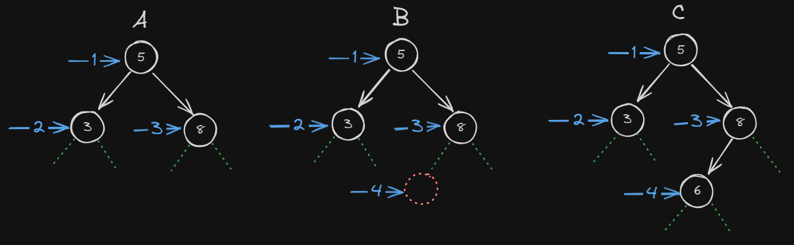

# Binary Tree Comparison

When we compare 2 binary threes (both values and shape) we can use Depth First Search (actually not search traversal in this situation) approach. Because depth first search preserves the shape of the tree. We can do this with recursive calls. We have 3 base cases these are;

- If both of the current nodes (a and b) are null return true. This means we are on a leaf node and we called the function on null argument. If both of these nodes are null that means both of three doesn't have more leaf node.
- If a or b is null return false. In this situation this means we called function such a argument that one of them is not null means one of them has child node that other one does not have.
- If a's and b's values are not equal. This means current nodes not equal on values wise.

Implementation might look like this;

```ts
type BinaryTree<T> = {
  value: T;
  left: BinaryTree<T> | null;
  right: BinaryTree<T> | null;
};
function compare<T extends number | string | boolean>(
  a: BinaryTree<T> | null,
  b: BinaryTree<T> | null
): boolean {
  // structural check (you are on a leaf node)
  if (a === null && b === null) {
    return true;
  }
  // structural check (one of them is null so structural mismatch)
  if (a === null || b === null) {
    return false;
  }
  // value check
  if (a.value !== b.value) {
    return false;
  }
  // recursive step
  return compare(a.left, b.left) && compare(a.right, b.right);
}
```

At recursive step means both left and right side of the trees should be true(means they equal) otherwise fucntion will return false.

## Example

We wil compare 3 threes in below image with algorithm that above.

<br>

### Compare A, B and C

1. None of the base cases met. Both <b>a and b not null</b>, <b>a or b is not null</b>, <b>5 equals 5</b> so continue to <b>Step 2</b> with recursive call <b>compare(a.left,b.left) && ...</b> we first call left side then right so call stack continues with left side of the trees.
2. None if the base cases met. Both <b>a and b not null</b>, <b>a or b is not null</b>, <b>3 equals 3</b> so continue with recursive call <b>compare(a.left,b.left) && compare(a.right,b.right)</b> which we know that we are passing null arguments (node 3 doesn't have child on both left and right side)so next call return <b>true</b>. We hit a base case and function return true and call stack returns the <b>Step 1</b>.
3. Callstack is at <b>compare(a.left,b.left) (<i>true</i>) && compare(a.right,b.right)</b>. In <b>Step 2</b> we see that left side returned true so this time we call function with right side. Right side is also returns true I will not explain it why right side returns true but you can follow the algorithm to see yourself the result.
4. If we compared the B and C first 3 steps would be the same except the when we compare the left side we would hit the base case where C has a child node (6) but B doesn't have the child (outlined with red dots) so we hit the base case <b>one of the current node is null</b>. When we returned false because we are && returns whole function would return false.
